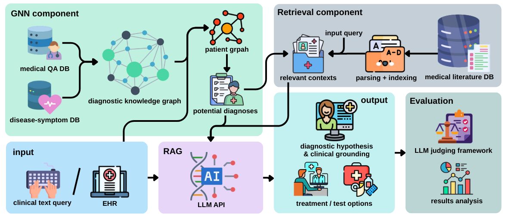
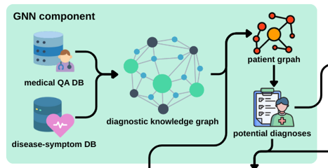
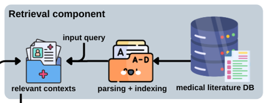

# gnn-rag-medicalQA

- [Project Overview](#welcome-to-our-gnn-rag-medicalqa-project)👓
- [Quick start (raw project run)](#quick-start-raw-project-run)
  - [The Easy Way to Run the Project](#the-easy-way-to-run-the-project)🐳
  - [The Raw Project Run](#the-raw-project-run)🐍
- [How Does It Work?](#how-does-it-work)🤔
- [About The Code](#about-the-code)⚙️
- [Download / Build the Full Vector DB](vector_db_files/ReadMe.md#download-and-use)🗄️

<a name="welcome-to-our-gnn-rag-medicalqa-project"></a>
## Welcome to our gnn-rag-medicalQA project!
This project aims to identify potential diseases from a user's query consisting of reported symptoms and any known medical conditions.

Platforms
- Supports Linux  and Windows  operating systems.
- Make sure to have <b>Docker installed</b> for the <b>easy run option</b>.
- Make sure to have <b>Conda</b> installed for the <b>raw project run option</b>. You may need to install Docker either way if you want to run on Windows.

<div style="border:1px solid #e1e4e8; padding:12px 16px; border-radius:6px;">
  <strong>📝 Note</strong>
  <ul style="margin:8px 0 0 18px; padding:0;">
    <li>This repo uses a sample of ~15k medical papers from PubMed Central; our full dataset contains ~1.2M papers.</li>
    <li>Want the full experience? Replace <code>milvus_pmc.db</code> with the full DB available <a href="https://technionmail-my.sharepoint.com/:f:/g/personal/sasson_noam_campus_technion_ac_il/EnIMQ7Zc3E9OizbXFroOKwgBSqOaUzHcredlW4swTZNcaQ?e=ZssrXv" target="_blank" rel="noopener noreferrer">here</a>.</li>
  </ul>
</div>


<!-- Note
- The vector database can be used as a ready-made resource. You can skip building it. See vector_db_files/README.md for “Get a ready-to-use vector DB”. -->

<a name="quick-start-raw-project-run"></a>
## Quick start (raw project run)
<a name="the-easy-way-to-run-the-project"></a>
### The Easy Way to Run the Project 


1) Clone this GitHub repository
2) Change .env.example to .env and set your API keys (you need to set at least one, get one from the Gemini API: [get Gemini API key](https://ai.google.dev/gemini-api/docs/api-key))
3) Run the following commands in your Docker-enabled terminal:
```bash
docker build -t med_qa_app .
docker run -d --name med_qa -p 5000:5000 med_qa_app
```

4) Access the application at http://localhost:5000 in your web browser :)


<div style="border:1px solid #ffffffff; padding:12px 16px; border-radius:6px;">
<strong>📝 Note</strong>
<ul style="margin:8px 0 0 18px; padding:0;">
  <li>Build takes ~22 minutes on a standard machine.</li>
  <li>After running the <code>docker run</code> command, the server may take a minute or two to start responding, so please be patient.</li>
</ul>
</div>

<a name="the-raw-project-run"></a>
### The Raw Project Run 

1) Do steps 1,2 from the easy way.
2) Creating the Conda environment:
- Open an Anaconda/Miniconda shell.

  run from the project root:<br><br>
  Linux:
  ```bash
  conda env create -f setup/environment_linux.yml
  # activate the environment (replace <name> with the 'name' in the YAML if needed)
  conda activate <name>
  ```

  Windows:
  ```powershell
  conda env create -f setup\environment_windows.yml
  # activate the environment (replace <name> with the 'name' in the YAML if needed)
  conda activate <name>
  ```

3) Acquire the full vector database (not mandatory if using Linux)
- Read vector_db_files/README.md and follow the instructions for your OS to either:
  - Download and use the ready-to-use vector DB (recommended).
  - Build the Milvus vector DB from scratch (not recommended and supports Linux only).
- Ensure your .env has a proper PATH_TO_MILVUS_DB value as described there.

4) Running the pipeline:
- After Milvus is up and reachable, run from the project root:<br>

  Linux + Windows:
  ```bash
    python pipeline.py
  ```

Enjoy!

<a name="how-does-it-work"></a>
## How Does It Work?


<br><br>
The system operates in two main stages: **Context Expansion** and **Answer Generation**, combining Graph Neural Networks (GNN) and Retrieval-Augmented Generation (RAG) into a single diagnostic support pipeline.

### Part 1 - Context Expansion
The process begins with a user-provided query describing symptoms and relevant medical history. The system expands this input using two complementary components.

 #### A) GNN-based Disease Prediction 
Based on historical medical data derived from patient querys and physician diagnoses, we train a Graph Neural Network (GNN) to predict potential diseases from a user’s reported symptoms.
For each individual in the training dataset, we construct a dedicated graph: the patient is represented as a node, which is connected to “symptom nodes” extracted from their query. These symptom nodes are connected to “disease nodes” according to symptom–disease co-occurrence patterns observed in the data. (The construction of the main graph is hard-coded and includes several additional details that are discussed in the accompanying report.) The diseases recorded in the physician’s diagnosis serve as ground-truth labels, and using this graph structure, the GNN is trained to infer likely diseases for new user inputs based solely on their symptom descriptions. The specific architecture and training procedure are detailed in the report.
 
 #### B) RAG-based Document Retrieval 
Once the GNN produces a set of candidate diseases, we apply Retrieval-Augmented Generation (RAG) to retrieve relevant medical abstracts from the <b>2016 Clinical Decision Support Track</b> dataset containing ~1.2M medical papers from PubMed Central tackling a similar problem to ours - retrieving relevant medical papers based on users' querys. We use only the abstracts and associated metadata (e.g., title, authors, journal). A vector database is constructed using PubMedBERT embeddings, organized with an IVF_FLAT index for efficient similarity search. The IVF_FLAT structure partitions the embedding space into 64 clusters via k-means and searches the 10 nearest clusters during retrieval to balance speed and accuracy. Using the GNN-predicted diseases as additional context, the system queries this vector database to obtain the most relevant medical abstracts for downstream reasoning.

### Part 2 - Answer Generation
The final step synthesizes all compiled knowledge into a coherent clinical response.
We utilize the Google Gemini 2.5 Flash Lite Large Language Model (LLM), selected for its efficient reasoning capability, operating under a controlled, low-temperature setting ($\tau=0.2$). The LLM is conditioned on the original user query, the structured disease hypotheses, and the retrieved evidence. The prompt is meticulously engineered to enforce medically responsible generation, requiring the model to:
    * Formulate a cohesive diagnostic hypothesis.
    * Present transparent clinical reasoning that integrates both structured (GNN) and retrieved (RAG) evidence.
    * Recommend responsible next steps (e.g., monitoring, seeking professional consultation).
    * Conclude with a mandatory safety disclaimer.

<a name="about-the-code"></a>
## About The Code
The complete system orchestration is managed by the **pipeline.py** script, which integrates the GNN, RAG, and LLM components for a full run of the project.<br>

The core execution flow involves three main function calls:
1) Acquire potential diseases using the GNN model with <code>graph_model.text_forward(user_input)</code>
2) Retrieve relevant medical abstracts using RAG with <code>searcher.search(prompt, limit=5)</code>
3) Generate the final answer using the LLM with <code>run_generation(query, graph_results, search_results_with_gnn)</code>

Additional optional parameters exist for evaluation and testing, such as supplying ground-truth diagnoses to compute performance metrics.


